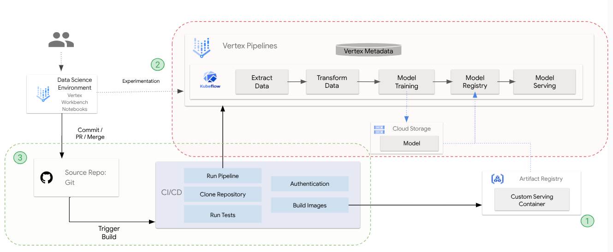

# MLOps Development Cycle - Housing Model Demo

Showcases an end-to-end demo of the Vertex AI development lifecycle using custom housing model data and serving container requirements

# Getting Started



**0. Clone this code repsoitory in your user environment** <br>
**1. Create a custom serving container** <br>
* [01-custom-serving-container.ipynb](./notebooks/01-custom-serving-container.ipynb) : This notebook demonstrates how to build and push a custom serving container that does not include the model artifact. When the pipeline runs (Step 2), the container is fetched and dynamically loads the model from Cloud Storage at runtime, demonstrating decoupled model deployment using Vertex AI.
    
    
**2. Experiment & Build ML pipeline that is deployed during the CI/CD process** 
* [02-model_pipeline.ipynb](./notebooks/02-model_pipeline.ipynb) : This notebook showcases an end-to-end Machine Learning Operations (MLOps) pipeline built with Vertex AI, leveraging the Ames Iowa Housing Data. It serves as a pattern for rapid experimentation using notebooks and demonstrates how to develop models within a structured, automated workflow


**3. CI/CD Pipeline integrates Vertex AI and Github Actions**
* Set-up [AutoMLOps Repo](https://github.com/GoogleCloudPlatform/automlops) and configure the source repo and specific toolings by carefully following the [user-guide slides for AutoMLOps](https://github.com/GoogleCloudPlatform/automlops/blob/main/AutoMLOps_Implementation_Guide_External.pdf) <br>
* This repo is configred to use Github Actions


## Prerequisites

Ensure the project environment, network settings, and service accounts used have the appropriate google cloud authentication and permissions to access the folloiwng services:
- `Vertex AI`
- `Cloud Storage`
- `Artifact Registry`
- `AutoMLOps user guide` [link](https://github.com/GoogleCloudPlatform/automlops/blob/main/AutoMLOps_Implementation_Guide_External.pdf)
-  Install [requirements.txt](./components/component_base/requirements.txt)

## AutoMLOps

[AutoMLOps Repo](https://github.com/GoogleCloudPlatform/automlops)

A service that automates & accelerates the AI/ML development lifecycle, bridging the gap between Data Science and DevOps. 

Users can generate, provision, and deploy CI/CD integrated processes & MLOps pipelines in a single interface, empowering data scientists to bring their models to production from months/weeks to hours

# Repo Folder structure

```bash
.
├── components                                     : Custom vertex pipeline components.
    ├──component_base                              : Contains all the python files, Dockerfile and requirements.txt
        ├── Dockerfile                             : Dockerfile containing all the python files for the components.
        ├── requirements.txt                       : Package requirements for all the python files for the components.
        ├── src                                    : Python source code directory.
            ├──component_a.py                      : Python file containing code for the component.
            ├──...(for each component)
    ├──component_a                                 : Components specs generated using AutoMLOps
        ├── component.yaml                         : Component yaml spec, acts as an I/O wrapper around the Docker container.
    ├──...(for each component)
├── configs                                        : Configurations for defining vertex ai pipeline and MLOps infra.
    ├── defaults.yaml                              : Runtime configuration variables.
├── images                                         : Custom container images for training models (optional).
├── pipelines                                      : Vertex ai pipeline definitions.
    ├── pipeline.py                                : Full pipeline definition; compiles pipeline spec and uploads to GCS.
    ├── pipeline_runner.py                         : Sends a PipelineJob to Vertex AI.
    ├── requirements.txt                           : Package requirements for running pipeline.py.
    ├── runtime_parameters                         : Variables to be used in a PipelineJob.
        ├── pipeline_parameter_values.json         : Json containing pipeline parameters.
├── provision                                      : Provision configurations and details.
    ├── provision_resources.sh                     : Provisions the necessary infra to run the MLOps pipeline.
    ├── provisioning_configs                       : (Optional) Relevant terraform/Pulumi config files for provisioning infa.
├── notebooks                                      : Jupyter notebooks
├── scripts                                        : Scripts for manually triggering the cloud run service.
    ├── build_components.sh                        : Submits a Cloud Build job that builds and pushes the components to the registry.
    ├── build_pipeline_spec.sh                     : Compiles the pipeline specs.
    ├── run_pipeline.sh                            : Submit the PipelineJob to Vertex AI.
    ├── run_all.sh                                 : Builds components, compiles pipeline specs, and submits the PipelineJob.
    ├── publish_to_topic.sh                        : Publishes a message to a Pub/Sub topic to invoke the pipeline job submission service.
├── services                                       : MLOps services related to continuous training.
    ├── submission_service                         : REST API service used to submit pipeline jobs to Vertex AI.
        ├── Dockerfile                             : Dockerfile for running the REST API service.
        ├── requirements.txt                       : Package requirements for the REST API service.
        ├── main.py                                : Python REST API source code. 
├── README.md                                      : Readme markdown file describing the contents of the generated directories.
└── cloudbuild.yaml                                : Cloudbuild configuration file for building custom components.
```

# References
* [Ames Iowa Housing Dataset](https://github.com/melindaleung/Ames-Iowa-Housing-Dataset)